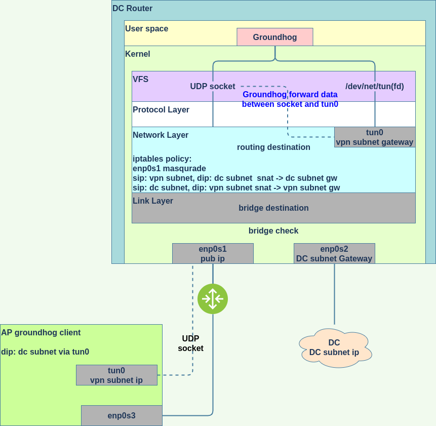
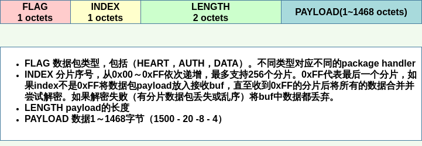

Groundhog
=========

内网穿透，socket代理，AP和DC组网工具

网络拓扑
-------

DC Router上一张网卡连接公网，一张网卡连接DC内部子网，并作为DC网络的默认网关，tun0作为VPN网段的默认网关。通过配置iptables的masquerade nat上网，内穿通过iptables的DNAT实现。DC网段和VPN网段需要做双向SNAT规则来实现DC和AP互通。
AP接入后，tun0上配置VPN网段的IP，并下发路由。

AP接入流程
---------

1. 认证授权
2. 获取VPN网段IP，和路由，并下发路由
3. 将到tun0的数据包封装并通过UDP发送给DC Router的服务端，从socket中收到数据后拆封后发给tun0
4. 每隔30秒发送一个心跳包

DC Router端处理连接流程
---------------------

1. 认证授权成功后在VPN网段中选择一个IP给AP，并将连接标记为"可用"，状态和IP对应
2. 下发路由
3. 将socket中收到的数据发给tun0，将tun0中收到的数据根据dst ip发送到对应的socket
4. 设置连接超时时间（5次心跳间隔），如果连接超时，直接断开连接。接收到心跳包后，将时间重置。

UDP发送大包问题
-------------

自定义groundhog协议，用于解决UDP分包重组问题。不处理分片丢失和乱序问题。

**groundhog协议头**

* FLAG 1Byte 表示数据包类型
* INDEX 1Byte 分片序号（0xFF表面最后一个分片或者不分片）
* LENGTH 2Btye 数据荷载长度
* PAYLOAD 数据荷载

**FLAG类型**

* 0x01(0000 0001) 心跳
* 0x02(0000 0010) 路由请求
* 0x04(0000 0100) 认证授权
* 0x08(0000 1000) 数据
* 0x10(0001 0000) 断开连接

不同类型的FLAG对应不同的数据包的handler。

**数据接受流程**

新建一个接受buf，用于存放数据包的payload。如果INDEX字段不为0xFF时，将payload中所有数据放入buf中。当接收到INDEX为0xFF的数据后，根据LENGTH数值读取payload中数据，并放入buf。后对buf中所有数据进行解密，如果解密失败，则说明数据可能由于篡改，丢失数据分片或者数据分片乱序。直接将buf中数据清空，日志记录失败package个数并继续。

其他需要注意事项
-------------

* 处理SIGINT和SIGTERM信号，当收到信号后需要清理事先下发的路由，再退出。